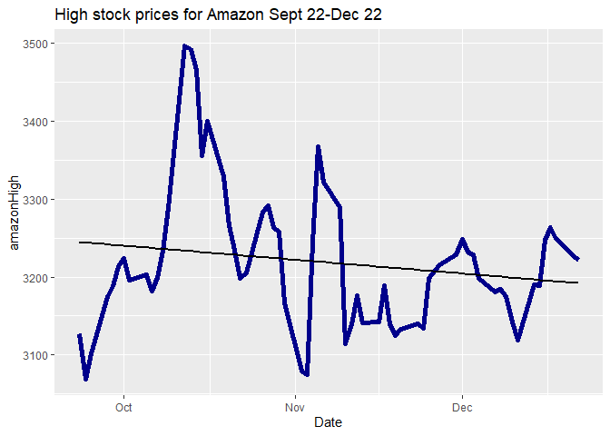
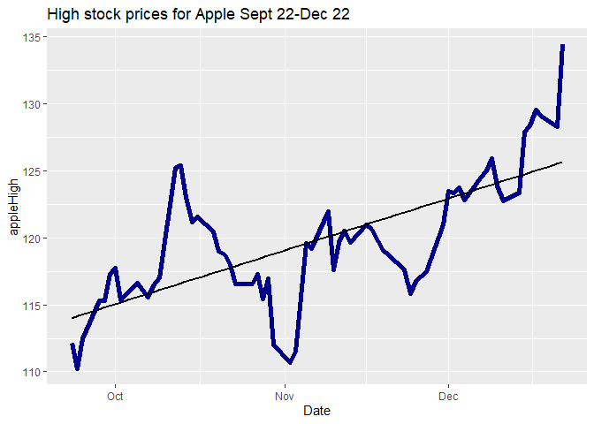
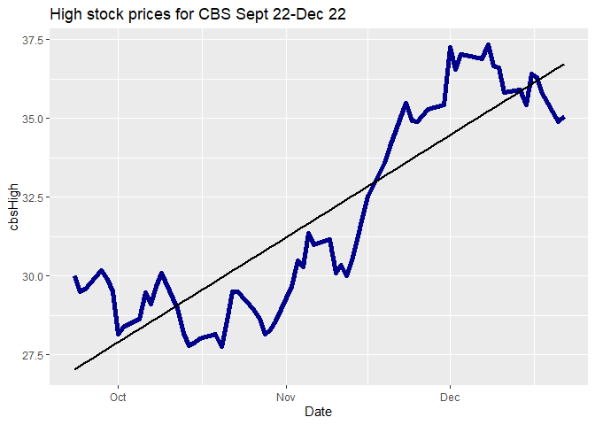
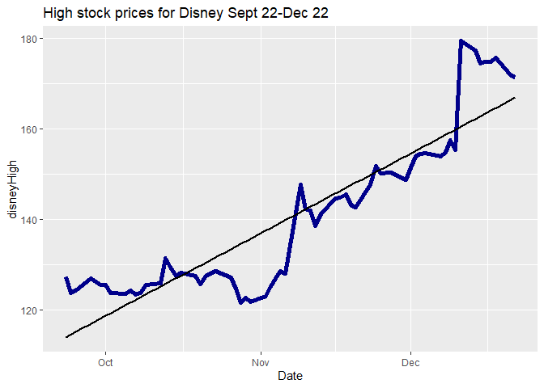
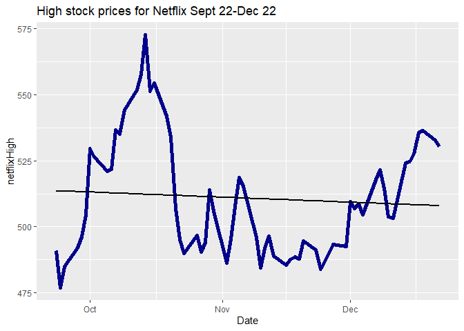

## Summary
### This project compars stock prices for 5 stocks: Apple, Netflix, CBS/Viacom, Amazon, and Disney. It took pirces from the Yahoo Finance website <https://finance.yahoo.com/> for the dates from September 22, 2020 to December 22,2020.


```r
#adding libraries
library(ggplot2)
library(ggthemes)
library(tidyr)
library(dplyr)
```

```
## 
## Attaching package: 'dplyr'
```

```
## The following objects are masked from 'package:stats':
## 
##     filter, lag
```

```
## The following objects are masked from 'package:base':
## 
##     intersect, setdiff, setequal, union
```

## Loading Data-creating data folder, downloading datasets from Yahoo Finance and loading data into R Studio.


## Data Wrangling
### Look at individual datasets, merge into a single dataset, and look at single dataset.

```
##      Date                Open           High           Low           Close     
##  Length:64          Min.   :2978   Min.   :3069   Min.   :2950   Min.   :3000  
##  Class :character   1st Qu.:3135   1st Qu.:3161   1st Qu.:3088   1st Qu.:3118  
##  Mode  :character   Median :3179   Median :3201   Median :3137   Median :3175  
##                     Mean   :3184   Mean   :3219   Mean   :3138   Mean   :3177  
##                     3rd Qu.:3215   3rd Qu.:3251   3rd Qu.:3172   3rd Qu.:3208  
##                     Max.   :3468   Max.   :3496   Max.   :3424   Max.   :3444  
##    Adj.Close        Volume       
##  Min.   :3000   Min.   :2369400  
##  1st Qu.:3118   1st Qu.:3472400  
##  Median :3175   Median :4364450  
##  Mean   :3177   Mean   :4574209  
##  3rd Qu.:3208   3rd Qu.:5544125  
##  Max.   :3444   Max.   :8386400
```

```
## 'data.frame':	64 obs. of  7 variables:
##  $ Date     : chr  "2020-09-23" "2020-09-24" "2020-09-25" "2020-09-28" ...
##  $ Open     : num  3120 2978 3055 3149 3175 ...
##  $ High     : num  3127 3069 3102 3175 3188 ...
##  $ Low      : num  2992 2965 2999 3117 3133 ...
##  $ Close    : num  3000 3020 3095 3174 3145 ...
##  $ Adj.Close: num  3000 3020 3095 3174 3145 ...
##  $ Volume   : int  5652700 5529400 4615200 4224200 3495800 4883400 4971900 5613100 3775300 5086900 ...
```

```
##      Date                Open            High            Low       
##  Length:64          Min.   :105.2   Min.   :110.2   Min.   :105.0  
##  Class :character   1st Qu.:115.0   1st Qu.:116.5   1st Qu.:113.6  
##  Mode  :character   Median :117.6   Median :119.1   Median :116.3  
##                     Mean   :118.2   Mean   :119.8   Mean   :116.7  
##                     3rd Qu.:121.1   3rd Qu.:123.1   3rd Qu.:119.7  
##                     Max.   :131.6   Max.   :134.4   Max.   :129.6  
##      Close         Adj.Close         Volume         
##  Min.   :107.1   Min.   :106.9   Min.   : 46691300  
##  1st Qu.:115.1   1st Qu.:114.9   1st Qu.: 88488100  
##  Median :117.4   Median :117.3   Median :113216700  
##  Mean   :118.3   Mean   :118.2   Mean   :118827627  
##  3rd Qu.:121.8   3rd Qu.:121.8   3rd Qu.:142990850  
##  Max.   :131.9   Max.   :131.9   Max.   :262330500
```

```
## 'data.frame':	64 obs. of  7 variables:
##  $ Date     : chr  "2020-09-23" "2020-09-24" "2020-09-25" "2020-09-28" ...
##  $ Open     : num  112 105 108 115 115 ...
##  $ High     : num  112 110 112 115 115 ...
##  $ Low      : num  107 105 108 113 114 ...
##  $ Close    : num  107 108 112 115 114 ...
##  $ Adj.Close: num  107 108 112 115 114 ...
##  $ Volume   : int  150718700 167743300 149981400 137672400 99382200 142675200 116120400 144712000 106243800 161498200 ...
```

```
##      Date                Open            High            Low       
##  Length:64          Min.   :27.15   Min.   :27.77   Min.   :26.99  
##  Class :character   1st Qu.:28.68   1st Qu.:29.07   1st Qu.:28.23  
##  Mode  :character   Median :29.98   Median :30.32   Median :29.21  
##                     Mean   :31.28   Mean   :31.83   Mean   :30.79  
##                     3rd Qu.:34.80   3rd Qu.:35.31   3rd Qu.:34.24  
##                     Max.   :36.80   Max.   :37.32   Max.   :36.46  
##      Close         Adj.Close         Volume        
##  Min.   :27.13   Min.   :26.95   Min.   : 3903900  
##  1st Qu.:28.55   1st Qu.:28.35   1st Qu.: 8622475  
##  Median :29.80   Median :29.60   Median : 9489900  
##  Mean   :31.37   Mean   :31.19   Mean   :11025191  
##  3rd Qu.:34.86   3rd Qu.:34.84   3rd Qu.:12624750  
##  Max.   :36.95   Max.   :36.70   Max.   :26843600
```

```
## 'data.frame':	64 obs. of  7 variables:
##  $ Date     : chr  "2020-09-23" "2020-09-24" "2020-09-25" "2020-09-28" ...
##  $ Open     : num  29.7 28.6 28.9 30 29.6 ...
##  $ High     : num  30 29.5 29.6 30.2 29.9 ...
##  $ Low      : num  28.6 28.1 28.8 29.6 28.9 ...
##  $ Close    : num  28.8 29.1 29.5 29.8 29 ...
##  $ Adj.Close: num  28.6 29 29.3 29.6 28.8 ...
##  $ Volume   : int  9744900 13542900 9418000 9323400 11466500 9320200 13944100 9109000 5874900 8724400 ...
```

```
##      Date                Open            High            Low       
##  Length:64          Min.   :118.2   Min.   :121.5   Min.   :117.2  
##  Class :character   1st Qu.:124.3   1st Qu.:125.7   1st Qu.:123.2  
##  Mode  :character   Median :129.5   Median :130.4   Median :127.1  
##                     Mean   :138.4   Mean   :140.2   Mean   :136.7  
##                     3rd Qu.:149.5   3rd Qu.:151.5   3rd Qu.:148.0  
##                     Max.   :174.0   Max.   :179.4   Max.   :172.3  
##      Close         Adj.Close         Volume        
##  Min.   :118.5   Min.   :118.5   Min.   : 5177700  
##  1st Qu.:124.1   1st Qu.:124.1   1st Qu.: 7266400  
##  Median :128.7   Median :128.7   Median : 8998900  
##  Mean   :138.5   Mean   :138.5   Mean   :11764559  
##  3rd Qu.:150.0   3rd Qu.:150.0   3rd Qu.:11443700  
##  Max.   :175.7   Max.   :175.7   Max.   :87410700
```

```
## 'data.frame':	64 obs. of  7 variables:
##  $ Date     : chr  "2020-09-23" "2020-09-24" "2020-09-25" "2020-09-28" ...
##  $ Open     : num  127 122 121 126 126 ...
##  $ High     : num  127 124 124 127 126 ...
##  $ Low      : num  123 121 121 125 124 ...
##  $ Close    : num  123 122 124 126 125 ...
##  $ Adj.Close: num  123 122 124 126 125 ...
##  $ Volume   : int  8323600 8480000 6851800 6283700 7405800 13556800 8908300 6490200 5919200 9052000 ...
```

```
##      Date                Open            High            Low       
##  Length:64          Min.   :470.5   Min.   :477.0   Min.   :463.4  
##  Class :character   1st Qu.:486.7   1st Qu.:491.9   1st Qu.:478.9  
##  Mode  :character   Median :495.2   Median :506.3   Median :491.6  
##                     Mean   :503.3   Mean   :510.8   Mean   :495.6  
##                     3rd Qu.:518.1   3rd Qu.:526.6   3rd Qu.:507.6  
##                     Max.   :562.6   Max.   :572.5   Max.   :541.0  
##      Close         Adj.Close         Volume        
##  Min.   :470.5   Min.   :470.5   Min.   : 1906600  
##  1st Qu.:486.0   1st Qu.:486.0   1st Qu.: 3656950  
##  Median :497.9   Median :497.9   Median : 4348750  
##  Mean   :503.3   Mean   :503.3   Mean   : 5158270  
##  3rd Qu.:523.0   3rd Qu.:523.0   3rd Qu.: 5644475  
##  Max.   :554.1   Max.   :554.1   Max.   :17405700
```

```
## 'data.frame':	64 obs. of  7 variables:
##  $ Date     : chr  "2020-09-23" "2020-09-24" "2020-09-25" "2020-09-28" ...
##  $ Open     : num  491 471 474 489 490 ...
##  $ High     : num  491 477 485 492 496 ...
##  $ Low      : num  469 468 468 478 487 ...
##  $ Close    : num  471 473 483 491 493 ...
##  $ Adj.Close: num  471 473 483 491 493 ...
##  $ Volume   : int  3726400 3727200 3769400 4773500 3541500 4631100 8153700 6071200 4088100 4199000 ...
```

```
##       Date              amazonOpen     amazonHigh     amazonLow   
##  Min.   :2020-09-23   Min.   :2978   Min.   :3069   Min.   :2950  
##  1st Qu.:2020-10-14   1st Qu.:3135   1st Qu.:3161   1st Qu.:3088  
##  Median :2020-11-05   Median :3179   Median :3201   Median :3137  
##  Mean   :2020-11-06   Mean   :3184   Mean   :3219   Mean   :3138  
##  3rd Qu.:2020-11-30   3rd Qu.:3215   3rd Qu.:3251   3rd Qu.:3172  
##  Max.   :2020-12-22   Max.   :3468   Max.   :3496   Max.   :3424  
##   amazonClose   amazonAdj.Close  amazonVolume       appleOpen    
##  Min.   :3000   Min.   :3000    Min.   :2369400   Min.   :105.2  
##  1st Qu.:3118   1st Qu.:3118    1st Qu.:3472400   1st Qu.:115.0  
##  Median :3175   Median :3175    Median :4364450   Median :117.6  
##  Mean   :3177   Mean   :3177    Mean   :4574209   Mean   :118.2  
##  3rd Qu.:3208   3rd Qu.:3208    3rd Qu.:5544125   3rd Qu.:121.1  
##  Max.   :3444   Max.   :3444    Max.   :8386400   Max.   :131.6  
##    appleHigh        appleLow       appleClose    appleAdj.Close 
##  Min.   :110.2   Min.   :105.0   Min.   :107.1   Min.   :106.9  
##  1st Qu.:116.5   1st Qu.:113.6   1st Qu.:115.1   1st Qu.:114.9  
##  Median :119.1   Median :116.3   Median :117.4   Median :117.3  
##  Mean   :119.8   Mean   :116.7   Mean   :118.3   Mean   :118.2  
##  3rd Qu.:123.1   3rd Qu.:119.7   3rd Qu.:121.8   3rd Qu.:121.8  
##  Max.   :134.4   Max.   :129.7   Max.   :131.9   Max.   :131.9  
##   appleVolume           cbsOpen         cbsHigh          cbsLow     
##  Min.   : 46691300   Min.   :27.15   Min.   :27.77   Min.   :26.99  
##  1st Qu.: 88488100   1st Qu.:28.68   1st Qu.:29.07   1st Qu.:28.23  
##  Median :113216700   Median :29.98   Median :30.32   Median :29.21  
##  Mean   :118827627   Mean   :31.28   Mean   :31.83   Mean   :30.79  
##  3rd Qu.:142990850   3rd Qu.:34.80   3rd Qu.:35.31   3rd Qu.:34.24  
##  Max.   :262330500   Max.   :36.80   Max.   :37.32   Max.   :36.46  
##     cbsClose      cbsAdj.Close     cbsVolume          disneyOpen   
##  Min.   :27.13   Min.   :26.95   Min.   : 3903900   Min.   :118.2  
##  1st Qu.:28.55   1st Qu.:28.36   1st Qu.: 8622475   1st Qu.:124.3  
##  Median :29.80   Median :29.61   Median : 9489900   Median :129.5  
##  Mean   :31.37   Mean   :31.19   Mean   :11025191   Mean   :138.4  
##  3rd Qu.:34.86   3rd Qu.:34.84   3rd Qu.:12624750   3rd Qu.:149.5  
##  Max.   :36.95   Max.   :36.70   Max.   :26843600   Max.   :174.0  
##    disneyHigh      disneyLow      disneyClose    disneyAdj.Close
##  Min.   :121.5   Min.   :117.2   Min.   :118.5   Min.   :118.5  
##  1st Qu.:125.7   1st Qu.:123.2   1st Qu.:124.1   1st Qu.:124.1  
##  Median :130.4   Median :127.1   Median :128.7   Median :128.7  
##  Mean   :140.2   Mean   :136.7   Mean   :138.5   Mean   :138.5  
##  3rd Qu.:151.5   3rd Qu.:148.0   3rd Qu.:150.0   3rd Qu.:150.0  
##  Max.   :179.4   Max.   :172.3   Max.   :175.7   Max.   :175.7  
##   disneyVolume       netflixOpen     netflixHigh      netflixLow   
##  Min.   : 5177700   Min.   :470.5   Min.   :477.0   Min.   :463.4  
##  1st Qu.: 7266400   1st Qu.:486.7   1st Qu.:491.9   1st Qu.:478.9  
##  Median : 8998900   Median :495.2   Median :506.3   Median :491.6  
##  Mean   :11764559   Mean   :503.3   Mean   :510.8   Mean   :495.6  
##  3rd Qu.:11443700   3rd Qu.:518.1   3rd Qu.:526.6   3rd Qu.:507.6  
##  Max.   :87410700   Max.   :562.6   Max.   :572.5   Max.   :541.0  
##   netflixClose   netflixyAdj.Close netflixVolume     
##  Min.   :470.5   Min.   :470.5     Min.   : 1906600  
##  1st Qu.:486.0   1st Qu.:486.0     1st Qu.: 3656950  
##  Median :497.9   Median :497.9     Median : 4348750  
##  Mean   :503.3   Mean   :503.3     Mean   : 5158270  
##  3rd Qu.:523.0   3rd Qu.:523.0     3rd Qu.: 5644475  
##  Max.   :554.1   Max.   :554.1     Max.   :17405700
```

```
## 'data.frame':	64 obs. of  31 variables:
##  $ Date             : Date, format: "2020-09-23" "2020-09-24" ...
##  $ amazonOpen       : num  3120 2978 3055 3149 3175 ...
##  $ amazonHigh       : num  3127 3069 3102 3175 3188 ...
##  $ amazonLow        : num  2992 2965 2999 3117 3133 ...
##  $ amazonClose      : num  3000 3020 3095 3174 3145 ...
##  $ amazonAdj.Close  : num  3000 3020 3095 3174 3145 ...
##  $ amazonVolume     : num  5652700 5529400 4615200 4224200 3495800 ...
##  $ appleOpen        : num  112 105 108 115 115 ...
##  $ appleHigh        : num  112 110 112 115 115 ...
##  $ appleLow         : num  107 105 108 113 114 ...
##  $ appleClose       : num  107 108 112 115 114 ...
##  $ appleAdj.Close   : num  107 108 112 115 114 ...
##  $ appleVolume      : num  1.51e+08 1.68e+08 1.50e+08 1.38e+08 9.94e+07 ...
##  $ cbsOpen          : num  29.7 28.6 28.9 30 29.6 ...
##  $ cbsHigh          : num  30 29.5 29.6 30.2 29.9 ...
##  $ cbsLow           : num  28.6 28.1 28.8 29.6 28.9 ...
##  $ cbsClose         : num  28.8 29.1 29.5 29.8 29 ...
##  $ cbsAdj.Close     : num  28.6 28.9 29.3 29.6 28.8 ...
##  $ cbsVolume        : num  9744900 13542900 9418000 9323400 11466500 ...
##  $ disneyOpen       : num  127 122 121 126 126 ...
##  $ disneyHigh       : num  127 124 124 127 126 ...
##  $ disneyLow        : num  123 121 121 125 124 ...
##  $ disneyClose      : num  123 122 124 126 125 ...
##  $ disneyAdj.Close  : num  123 122 124 126 125 ...
##  $ disneyVolume     : num  8323600 8480000 6851800 6283700 7405800 ...
##  $ netflixOpen      : num  491 471 474 489 490 ...
##  $ netflixHigh      : num  491 477 485 492 496 ...
##  $ netflixLow       : num  469 468 468 478 487 ...
##  $ netflixClose     : num  471 473 483 491 493 ...
##  $ netflixyAdj.Close: num  471 473 483 491 493 ...
##  $ netflixVolume    : num  3726400 3727200 3769400 4773500 3541500 ...
```

## Plots of High prices


```
## `geom_smooth()` using formula 'y ~ x'
```

<!-- -->

```
## `geom_smooth()` using formula 'y ~ x'
```

<!-- -->

```
## `geom_smooth()` using formula 'y ~ x'
```

<!-- -->

```
## `geom_smooth()` using formula 'y ~ x'
```

<!-- -->

```
## `geom_smooth()` using formula 'y ~ x'
```

<!-- -->
