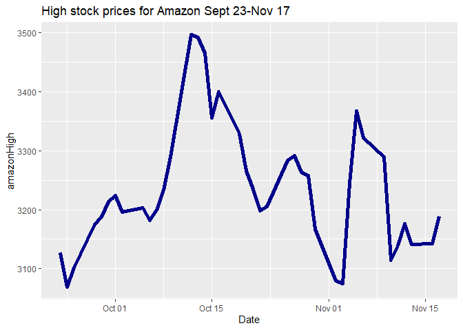
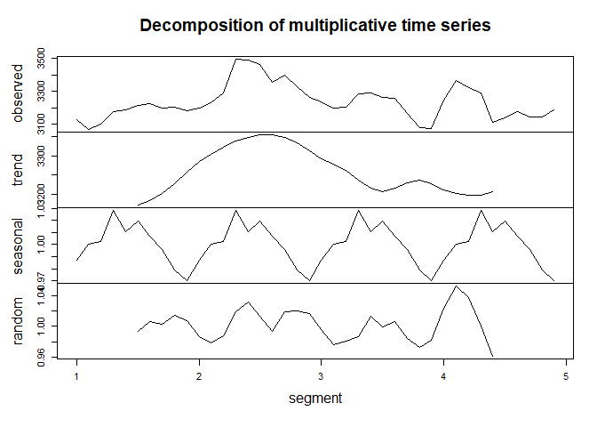
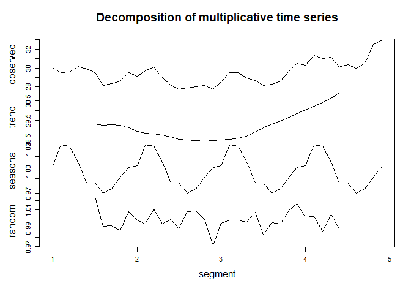
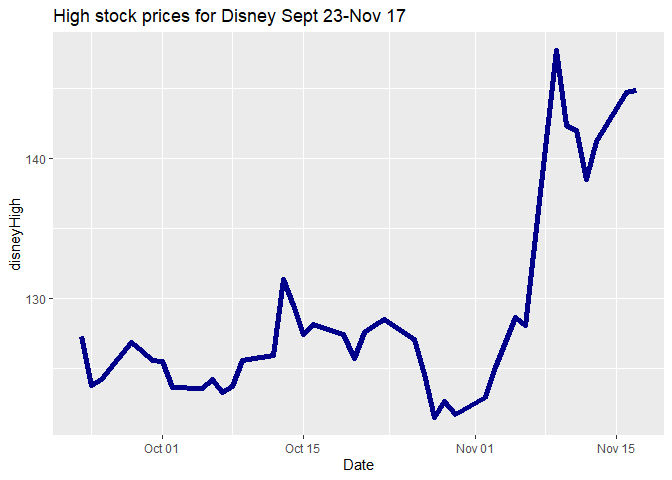

## Summary
### This project compares the high stock prices for 5 stocks: Apple, Netflix, CBS/Viacom, Amazon, and Disney. It took prices from the Yahoo Finance website <https://finance.yahoo.com/> for the dates from September 23, 2020 to November 17, 2020 when the New York Stock Exchange was open. For each stock, it used the high prices for the first 24 dates in the time period to predict the high prices for the next 16 dates.


```r
#attach libraries
library(ggplot2)
library(ggthemes)
library(tidyr)
library(quantmod)
```

```
## Loading required package: xts
```

```
## Loading required package: zoo
```

```
## 
## Attaching package: 'zoo'
```

```
## The following objects are masked from 'package:base':
## 
##     as.Date, as.Date.numeric
```

```
## Loading required package: TTR
```

```
## Registered S3 method overwritten by 'quantmod':
##   method            from
##   as.zoo.data.frame zoo
```

```r
library(dplyr)
```

```
## 
## Attaching package: 'dplyr'
```

```
## The following objects are masked from 'package:xts':
## 
##     first, last
```

```
## The following objects are masked from 'package:stats':
## 
##     filter, lag
```

```
## The following objects are masked from 'package:base':
## 
##     intersect, setdiff, setequal, union
```

```r
library(forecast)
```

## Loading Data
### Creating data folder, downloading datasets from Yahoo Finance and loading data into R Studio.


```r
if(!dir.exists("./data")) {dir.create("./data")}
download.file("https://query1.finance.yahoo.com/v7/finance/download/AMZN?period1=1600819200&period2=1605657600&interval=1d&events=history&includeAdjustedClose=true","./data/amazon.csv")

download.file("https://query1.finance.yahoo.com/v7/finance/download/AAPL?period1=1600819200&period2=1605657600&interval=1d&events=history&includeAdjustedClose=truee","./data/apple.csv")

download.file("https://query1.finance.yahoo.com/v7/finance/download/VIAC?period1=1600819200&period2=1605657600&interval=1d&events=history&includeAdjustedClose=true","./data/cbs.csv")

download.file("https://query1.finance.yahoo.com/v7/finance/download/DIS?period1=1600819200&period2=1605657600&interval=1d&events=history&includeAdjustedClose=true","./data/disney.csv")

download.file("https://query1.finance.yahoo.com/v7/finance/download/NFLX?period1=1600819200&period2=1605657600&interval=1d&events=history&includeAdjustedClose=true", "./data/netflix.csv")
amazon<-read.csv("./data/amazon.csv")
apple<-read.csv("./data/apple.csv")
disney<-read.csv("./data/disney.csv")
cbs<-read.csv("./data/cbs.csv")
netflix<-read.csv("./data/netflix.csv")
```

## Data Wrangling
### Look at datasets. Merge into a single dataset and look at merged dataset.


```
##      Date                Open           High           Low           Close     
##  Length:40          Min.   :2978   Min.   :3069   Min.   :2950   Min.   :3000  
##  Class :character   1st Qu.:3140   1st Qu.:3173   1st Qu.:3086   1st Qu.:3128  
##  Mode  :character   Median :3187   Median :3209   Median :3137   Median :3181  
##                     Mean   :3193   Mean   :3235   Mean   :3140   Mean   :3185  
##                     3rd Qu.:3226   3rd Qu.:3289   3rd Qu.:3179   3rd Qu.:3226  
##                     Max.   :3468   Max.   :3496   Max.   :3424   Max.   :3444  
##    Adj.Close        Volume       
##  Min.   :3000   Min.   :3174100  
##  1st Qu.:3128   1st Qu.:4304800  
##  Median :3181   Median :4939900  
##  Mean   :3185   Mean   :5190162  
##  3rd Qu.:3226   3rd Qu.:5799200  
##  Max.   :3444   Max.   :8386400
```

```
## 'data.frame':	40 obs. of  7 variables:
##  $ Date     : chr  "2020-09-23" "2020-09-24" "2020-09-25" "2020-09-28" ...
##  $ Open     : num  3120 2978 3055 3149 3175 ...
##  $ High     : num  3127 3069 3102 3175 3188 ...
##  $ Low      : num  2992 2965 2999 3117 3133 ...
##  $ Close    : num  3000 3020 3095 3174 3145 ...
##  $ Adj.Close: num  3000 3020 3095 3174 3145 ...
##  $ Volume   : int  5652700 5529400 4615200 4224200 3495800 4896100 4971900 5613100 3775300 5086900 ...
```

```
##      Date                Open            High            Low       
##  Length:40          Min.   :105.2   Min.   :110.2   Min.   :105.0  
##  Class :character   1st Qu.:114.0   1st Qu.:115.5   1st Qu.:112.3  
##  Mode  :character   Median :116.0   Median :117.3   Median :114.6  
##                     Mean   :115.9   Mean   :117.6   Mean   :114.2  
##                     3rd Qu.:118.8   3rd Qu.:119.9   3rd Qu.:116.6  
##                     Max.   :125.3   Max.   :125.4   Max.   :119.7  
##      Close         Adj.Close         Volume         
##  Min.   :107.1   Min.   :106.8   Min.   : 74271000  
##  1st Qu.:114.7   1st Qu.:114.4   1st Qu.:101617725  
##  Median :116.0   Median :115.7   Median :118379850  
##  Mean   :115.9   Mean   :115.6   Mean   :127694842  
##  3rd Qu.:119.0   3rd Qu.:118.6   3rd Qu.:145066300  
##  Max.   :124.4   Max.   :124.0   Max.   :262330500
```

```
## 'data.frame':	40 obs. of  7 variables:
##  $ Date     : chr  "2020-09-23" "2020-09-24" "2020-09-25" "2020-09-28" ...
##  $ Open     : num  112 105 108 115 115 ...
##  $ High     : num  112 110 112 115 115 ...
##  $ Low      : num  107 105 108 113 114 ...
##  $ Close    : num  107 108 112 115 114 ...
##  $ Adj.Close: num  107 108 112 115 114 ...
##  $ Volume   : int  150718700 167743300 149981400 137672400 99382200 142675200 116120400 144712000 106243800 161498200 ...
```

```
##      Date                Open            High            Low       
##  Length:40          Min.   :27.15   Min.   :27.77   Min.   :26.99  
##  Class :character   1st Qu.:28.07   1st Qu.:28.52   1st Qu.:27.50  
##  Mode  :character   Median :28.85   Median :29.50   Median :28.52  
##                     Mean   :28.94   Mean   :29.49   Mean   :28.42  
##                     3rd Qu.:29.79   3rd Qu.:30.11   3rd Qu.:28.90  
##                     Max.   :31.60   Max.   :32.89   Max.   :30.99  
##      Close         Adj.Close         Volume        
##  Min.   :27.13   Min.   :26.95   Min.   : 4870500  
##  1st Qu.:28.10   1st Qu.:27.91   1st Qu.: 7796575  
##  Median :28.89   Median :28.69   Median : 9282400  
##  Mean   :28.98   Mean   :28.78   Mean   :10299750  
##  3rd Qu.:29.60   3rd Qu.:29.40   3rd Qu.:11809500  
##  Max.   :32.29   Max.   :32.07   Max.   :26843600
```

```
## 'data.frame':	40 obs. of  7 variables:
##  $ Date     : chr  "2020-09-23" "2020-09-24" "2020-09-25" "2020-09-28" ...
##  $ Open     : num  29.7 28.6 28.9 30 29.6 ...
##  $ High     : num  30 29.5 29.6 30.2 29.9 ...
##  $ Low      : num  28.6 28.1 28.8 29.6 28.9 ...
##  $ Close    : num  28.8 29.1 29.5 29.8 29 ...
##  $ Adj.Close: num  28.6 29 29.3 29.6 28.8 ...
##  $ Volume   : int  9744900 13542900 9418000 9323400 11466500 9358800 13944100 9109000 5874900 8724400 ...
```

```
##      Date                Open            High            Low       
##  Length:40          Min.   :118.2   Min.   :121.5   Min.   :117.2  
##  Class :character   1st Qu.:123.2   1st Qu.:124.2   1st Qu.:122.2  
##  Mode  :character   Median :125.0   Median :126.9   Median :123.7  
##                     Mean   :127.3   Mean   :128.8   Mean   :125.6  
##                     3rd Qu.:127.9   3rd Qu.:128.5   3rd Qu.:126.1  
##                     Max.   :144.4   Max.   :147.7   Max.   :142.6  
##      Close         Adj.Close         Volume        
##  Min.   :118.5   Min.   :118.5   Min.   : 5177700  
##  1st Qu.:123.3   1st Qu.:123.3   1st Qu.: 6758225  
##  Median :125.0   Median :125.0   Median : 8401800  
##  Mean   :127.3   Mean   :127.3   Mean   :10167175  
##  3rd Qu.:127.5   3rd Qu.:127.5   3rd Qu.:11094200  
##  Max.   :144.7   Max.   :144.7   Max.   :35634700
```

```
## 'data.frame':	40 obs. of  7 variables:
##  $ Date     : chr  "2020-09-23" "2020-09-24" "2020-09-25" "2020-09-28" ...
##  $ Open     : num  127 122 121 126 126 ...
##  $ High     : num  127 124 124 127 126 ...
##  $ Low      : num  123 121 121 125 124 ...
##  $ Close    : num  123 122 124 126 125 ...
##  $ Adj.Close: num  123 122 124 126 125 ...
##  $ Volume   : int  8323600 8480000 6851800 6283700 7405800 13642500 8908300 6490200 5919200 9052000 ...
```

```
##      Date                Open            High            Low       
##  Length:40          Min.   :470.5   Min.   :477.0   Min.   :463.4  
##  Class :character   1st Qu.:486.7   1st Qu.:491.5   1st Qu.:478.2  
##  Mode  :character   Median :493.6   Median :505.3   Median :484.9  
##                     Mean   :503.8   Mean   :511.8   Mean   :495.0  
##                     3rd Qu.:518.2   3rd Qu.:530.6   3rd Qu.:507.1  
##                     Max.   :562.6   Max.   :572.5   Max.   :541.0  
##      Close         Adj.Close         Volume        
##  Min.   :470.5   Min.   :470.5   Min.   : 3002700  
##  1st Qu.:485.0   1st Qu.:485.0   1st Qu.: 4171275  
##  Median :492.1   Median :492.1   Median : 5255050  
##  Mean   :502.8   Mean   :502.8   Mean   : 6030870  
##  3rd Qu.:525.9   3rd Qu.:525.9   3rd Qu.: 7140300  
##  Max.   :554.1   Max.   :554.1   Max.   :17405700
```

```
## 'data.frame':	40 obs. of  7 variables:
##  $ Date     : chr  "2020-09-23" "2020-09-24" "2020-09-25" "2020-09-28" ...
##  $ Open     : num  491 471 474 489 490 ...
##  $ High     : num  491 477 485 492 496 ...
##  $ Low      : num  469 468 468 478 487 ...
##  $ Close    : num  471 473 483 491 493 ...
##  $ Adj.Close: num  471 473 483 491 493 ...
##  $ Volume   : int  3726400 3727200 3769400 4773500 3541500 4634100 8153700 6071200 4088100 4199000 ...
```

```
##       Date              amazonOpen     amazonHigh     amazonLow   
##  Min.   :2020-09-23   Min.   :2978   Min.   :3069   Min.   :2950  
##  1st Qu.:2020-10-06   1st Qu.:3140   1st Qu.:3173   1st Qu.:3086  
##  Median :2020-10-20   Median :3187   Median :3209   Median :3137  
##  Mean   :2020-10-20   Mean   :3193   Mean   :3235   Mean   :3140  
##  3rd Qu.:2020-11-03   3rd Qu.:3226   3rd Qu.:3289   3rd Qu.:3179  
##  Max.   :2020-11-17   Max.   :3468   Max.   :3496   Max.   :3424  
##   amazonClose   amazonAdj.Close  amazonVolume       appleOpen    
##  Min.   :3000   Min.   :3000    Min.   :3174100   Min.   :105.2  
##  1st Qu.:3128   1st Qu.:3128    1st Qu.:4304800   1st Qu.:114.0  
##  Median :3181   Median :3181    Median :4939900   Median :116.0  
##  Mean   :3185   Mean   :3185    Mean   :5190162   Mean   :115.9  
##  3rd Qu.:3226   3rd Qu.:3226    3rd Qu.:5799200   3rd Qu.:118.8  
##  Max.   :3444   Max.   :3444    Max.   :8386400   Max.   :125.3  
##    appleHigh        appleLow       appleClose    appleAdj.Close 
##  Min.   :110.2   Min.   :105.0   Min.   :107.1   Min.   :106.8  
##  1st Qu.:115.5   1st Qu.:112.3   1st Qu.:114.7   1st Qu.:114.4  
##  Median :117.3   Median :114.6   Median :116.0   Median :115.7  
##  Mean   :117.6   Mean   :114.2   Mean   :115.9   Mean   :115.6  
##  3rd Qu.:119.9   3rd Qu.:116.6   3rd Qu.:119.0   3rd Qu.:118.6  
##  Max.   :125.4   Max.   :119.7   Max.   :124.4   Max.   :124.0  
##   appleVolume           cbsOpen         cbsHigh          cbsLow     
##  Min.   : 74271000   Min.   :27.15   Min.   :27.77   Min.   :26.99  
##  1st Qu.:101617725   1st Qu.:28.07   1st Qu.:28.52   1st Qu.:27.50  
##  Median :118379850   Median :28.84   Median :29.50   Median :28.52  
##  Mean   :127694842   Mean   :28.94   Mean   :29.49   Mean   :28.42  
##  3rd Qu.:145066300   3rd Qu.:29.79   3rd Qu.:30.11   3rd Qu.:28.90  
##  Max.   :262330500   Max.   :31.60   Max.   :32.89   Max.   :30.99  
##     cbsClose      cbsAdj.Close     cbsVolume          disneyOpen   
##  Min.   :27.13   Min.   :26.95   Min.   : 4870500   Min.   :118.2  
##  1st Qu.:28.10   1st Qu.:27.91   1st Qu.: 7796575   1st Qu.:123.2  
##  Median :28.89   Median :28.70   Median : 9282400   Median :125.0  
##  Mean   :28.98   Mean   :28.78   Mean   :10299750   Mean   :127.3  
##  3rd Qu.:29.60   3rd Qu.:29.40   3rd Qu.:11809500   3rd Qu.:127.9  
##  Max.   :32.29   Max.   :32.07   Max.   :26843600   Max.   :144.4  
##    disneyHigh      disneyLow      disneyClose    disneyAdj.Close
##  Min.   :121.5   Min.   :117.2   Min.   :118.5   Min.   :118.5  
##  1st Qu.:124.2   1st Qu.:122.2   1st Qu.:123.3   1st Qu.:123.3  
##  Median :126.9   Median :123.7   Median :125.0   Median :125.0  
##  Mean   :128.8   Mean   :125.6   Mean   :127.3   Mean   :127.3  
##  3rd Qu.:128.5   3rd Qu.:126.1   3rd Qu.:127.5   3rd Qu.:127.5  
##  Max.   :147.7   Max.   :142.6   Max.   :144.7   Max.   :144.7  
##   disneyVolume       netflixOpen     netflixHigh      netflixLow   
##  Min.   : 5177700   Min.   :470.5   Min.   :477.0   Min.   :463.4  
##  1st Qu.: 6758225   1st Qu.:486.7   1st Qu.:491.5   1st Qu.:478.2  
##  Median : 8401800   Median :493.6   Median :505.3   Median :484.9  
##  Mean   :10167175   Mean   :503.8   Mean   :511.8   Mean   :495.0  
##  3rd Qu.:11094200   3rd Qu.:518.2   3rd Qu.:530.6   3rd Qu.:507.1  
##  Max.   :35634700   Max.   :562.6   Max.   :572.5   Max.   :541.0  
##   netflixClose   netflixyAdj.Close netflixVolume     
##  Min.   :470.5   Min.   :470.5     Min.   : 3002700  
##  1st Qu.:485.0   1st Qu.:485.0     1st Qu.: 4171275  
##  Median :492.1   Median :492.1     Median : 5255050  
##  Mean   :502.8   Mean   :502.8     Mean   : 6030870  
##  3rd Qu.:525.9   3rd Qu.:525.9     3rd Qu.: 7140300  
##  Max.   :554.1   Max.   :554.1     Max.   :17405700
```

```
## 'data.frame':	40 obs. of  31 variables:
##  $ Date             : Date, format: "2020-09-23" "2020-09-24" ...
##  $ amazonOpen       : num  3120 2978 3055 3149 3175 ...
##  $ amazonHigh       : num  3127 3069 3102 3175 3188 ...
##  $ amazonLow        : num  2992 2965 2999 3117 3133 ...
##  $ amazonClose      : num  3000 3020 3095 3174 3145 ...
##  $ amazonAdj.Close  : num  3000 3020 3095 3174 3145 ...
##  $ amazonVolume     : num  5652700 5529400 4615200 4224200 3495800 ...
##  $ appleOpen        : num  112 105 108 115 115 ...
##  $ appleHigh        : num  112 110 112 115 115 ...
##  $ appleLow         : num  107 105 108 113 114 ...
##  $ appleClose       : num  107 108 112 115 114 ...
##  $ appleAdj.Close   : num  107 108 112 115 114 ...
##  $ appleVolume      : num  1.51e+08 1.68e+08 1.50e+08 1.38e+08 9.94e+07 ...
##  $ cbsOpen          : num  29.7 28.6 28.9 30 29.6 ...
##  $ cbsHigh          : num  30 29.5 29.6 30.2 29.9 ...
##  $ cbsLow           : num  28.6 28.1 28.8 29.6 28.9 ...
##  $ cbsClose         : num  28.8 29.1 29.5 29.8 29 ...
##  $ cbsAdj.Close     : num  28.6 28.9 29.3 29.6 28.8 ...
##  $ cbsVolume        : num  9744900 13542900 9418000 9323400 11466500 ...
##  $ disneyOpen       : num  127 122 121 126 126 ...
##  $ disneyHigh       : num  127 124 124 127 126 ...
##  $ disneyLow        : num  123 121 121 125 124 ...
##  $ disneyClose      : num  123 122 124 126 125 ...
##  $ disneyAdj.Close  : num  123 122 124 126 125 ...
##  $ disneyVolume     : num  8323600 8480000 6851800 6283700 7405800 ...
##  $ netflixOpen      : num  491 471 474 489 490 ...
##  $ netflixHigh      : num  491 477 485 492 496 ...
##  $ netflixLow       : num  469 468 468 478 487 ...
##  $ netflixClose     : num  471 473 483 491 493 ...
##  $ netflixyAdj.Close: num  471 473 483 491 493 ...
##  $ netflixVolume    : num  3726400 3727200 3769400 4773500 3541500 ...
```

## Amazon forecasting analysis
### The time chart of the data of the high stock prices for Amazon shows and increase in the high stock prices from September 23 to around October 14. From there, the trend generally in  decreased until around November 2 and a sharp increase on November 3. This preceded a decrease in the high stock price until around November 8. After that decerease, the trend generally remained steady.


```r
ggplot(data,aes(Date, amazonHigh, group=1))+
  geom_line(color="darkblue" ,size=2)+
  ggtitle("High stock prices for Amazon Sept 23-Nov 17")
```

<!-- -->

### The data was turned into a time series object in R with 40 observations, one for each day that the stock market was open during the time period. A multiplicative decomposition of the time series was conducted. Plotting the trend-cycle and seasonal indices shows that the data have an upward trend during the 1st 2 segments with a downward trend in the 3rd segment followed by a stability in the trend in the 4th segment. It also has seasonal fluctuations, with the data increaseing at the beginning of each segment, reaching apeak in the middle of the segment and decreasing by the end of the segment.The data also has fairly random residuals.


```r
#ts function creates time series object
ts1 <- ts(data$amazonHigh,frequency=10)
#decomposition
plot(decompose(ts1,type = "multiplicative"),xlab="segment")
```

<!-- -->

### Training and test data sets were created from the time series object with the high stock prices for the first 24 days(60% of the data) being put into the training data while the data for the remaining 16 days (40% of the data) were put into the test data set.


```r
#training & test sets
ts1Train <- window(ts1,start=1,end=3.3)
ts1Test <- window(ts1,start=3.4,end=4.9)
```

### Exponential smoothing with multiplicative errors was applied to the training data.  The plot of the forecasted data along with the observed data showed that the forecasted results did fall within the prediction bounds. 


```r
#exponential smoothing
ets1 <- ets(ts1Train)
ets1
```

```
## ETS(M,N,N) 
## 
## Call:
##  ets(y = ts1Train) 
## 
##   Smoothing parameters:
##     alpha = 0.9999 
## 
##   Initial states:
##     l = 3125.1279 
## 
##   sigma:  0.0196
## 
##      AIC     AICc      BIC 
## 279.5340 280.7340 283.0681
```

```r
#get predictions and prediction bounds with forecast function
fcast <- forecast(ets1)
plot(fcast); 
lines(ts1Test,col="red")
```

<!-- -->

### In terms of accuracy, the root mean squared error was 61 for the training data and 65 for the test data. With a minimum value of  and a maximum value of  ,  .


```r
#get accuracy
#accuracy(forecast,test set)
accuracy(fcast,ts1Test)
```

```
##                      ME      RMSE      MAE        MPE     MAPE      MASE
## Training set   6.577504  61.67829 43.88522  0.1883105 1.330191 0.2775902
## Test set     -79.229107 116.80991 96.42549 -2.5462514 3.060235 0.6099267
##                   ACF1 Theil's U
## Training set 0.1853532        NA
## Test set     0.5447402  1.498007
```

## Apple forecasting analysis


```r
ggplot(data,aes(Date, appleHigh, group=1))+
  geom_line(color="darkblue" ,size=2)+
  ggtitle("High stock prices for Apple Sept 23-Nov 17")
```

<!-- -->


```r
#ts function creates time series object
ts1 <- ts(data$appleHigh,frequency=10)
#decomposition
plot(decompose(ts1),xlab="segment")
```

<!-- -->


```r
#training & test sets-have to build sets with consecutive time points
ts1Train <- window(ts1,start=1,end=3.3)
#window function creates test set that starts at time point 2.16
ts1Test <- window(ts1,start=3.4,end=4.9)
```


```r
#exponential smoothing
#fit model that had different types of trends you want to fit
ets1 <- ets(ts1Train)
#get predictions and prediction bounds with forecast function
fcast <- forecast(ets1)
plot(fcast); 
lines(ts1Test,col="red")
```

<!-- -->


```r
#get accuracy
#accuracy(forecast,test set)
accuracy(fcast,ts1Test)
```

```
##                     ME     RMSE      MAE       MPE     MAPE      MASE
## Training set 0.1850931 2.155474 1.394282 0.1457702 1.173510 0.2787370
## Test set     0.9050000 3.558258 3.101250 0.6833750 2.647713 0.6199843
##                    ACF1 Theil's U
## Training set 0.09397187        NA
## Test set     0.70776444  1.422214
```

## CBS/Viacom forecasting analysis


```r
ggplot(data,aes(Date, cbsHigh, group=1))+
  geom_line(color="darkblue" ,size=2)+
  ggtitle("High stock prices for CBS/Viacom Sept 23-Nov 17")
```

<!-- -->


```r
#ts function creates time series object
ts1 <- ts(data$cbsHigh,frequency=10)
#decomposition
plot(decompose(ts1),xlab="segment")
```

<!-- -->


```r
#training & test sets
ts1Train <- window(ts1,start=1,end=3.3)
ts1Test <- window(ts1,start=3.4,end=4.9)
```


```r
#exponential smoothing
#fit model that had different types of trends you want to fit
ets1 <- ets(ts1Train)
#get predictions and prediction bounds with forecast function
fcast <- forecast(ets1)
plot(fcast); 
lines(ts1Test,col="red")
```

<!-- -->


```r
#get accuracy
#accuracy(forecast,test set)
accuracy(fcast,ts1Test)
```

```
##                       ME     RMSE       MAE        MPE     MAPE     MASE
## Training set -0.04409949 0.584818 0.4700718 -0.1700425 1.624446 0.633398
## Test set      1.30556897 1.871256 1.5630970  4.1293770 5.037798 2.106194
##                   ACF1 Theil's U
## Training set 0.1531483        NA
## Test set     0.6702398  2.377506
```

## Disney forecasting analysis


```r
ggplot(data,aes(Date, disneyHigh, group=1))+
  geom_line(color="darkblue" ,size=2)+
  ggtitle("High stock prices for Disney Sept 23-Nov 17")
```

<!-- -->


```r
#ts function creates time series object
ts1 <- ts(data$disneyHigh,frequency=10)
#decomposition
plot(decompose(ts1),xlab="segment")
```

<!-- -->


```r
#training & test sets
ts1Train <- window(ts1,start=1,end=3.3)
ts1Test <- window(ts1,start=3.4,end=4.9)
```


```r
#exponential smoothing
#fit model that had different types of trends you want to fit
ets1 <- ets(ts1Train)
#get predictions and prediction bounds with forecast function
fcast <- forecast(ets1)
plot(fcast); 
lines(ts1Test,col="red")
```

<!-- -->


```r
#get accuracy
#accuracy(forecast,test set)
accuracy(fcast,ts1Test)
```

```
##                      ME      RMSE      MAE        MPE      MAPE      MASE
## Training set 0.05591236  1.743291 1.242970 0.03219821 0.9798233 0.4375556
## Test set     5.27529531 10.854211 8.607068 3.48983108 6.2040540 3.0298958
##                    ACF1 Theil's U
## Training set 0.05275571        NA
## Test set     0.76285026  1.879288
```

## Netflix forecasting analysis


```r
ggplot(data,aes(Date, netflixHigh, group=1))+
  geom_line(color="darkblue" ,size=2)+
  ggtitle("High stock prices for Netflix Sept 23-Nov 17")
```

<!-- -->


```r
#ts function creates time series object
ts1 <- ts(data$netflixHigh,frequency=10)
#decomposition
plot(decompose(ts1),xlab="segment")
```

<!-- -->


```r
#training & test sets
ts1Train <- window(ts1,start=1,end=3.3)
ts1Test <- window(ts1,start=3.4,end=4.9)
```


```r
#exponential smoothing
#fit model that had different types of trends you want to fit
ets1 <- ets(ts1Train)
#get predictions and prediction bounds with forecast function
fcast <- forecast(ets1)
plot(fcast); 
lines(ts1Test,col="red")
```

<!-- -->


```r
#get accuracy
#accuracy(forecast,test set)
accuracy(fcast,ts1Test)
```

```
##                     ME     RMSE      MAE        MPE     MAPE      MASE
## Training set 0.2534795 11.70942 9.389351 0.02641231 1.797039 0.2144387
## Test set     0.5700515 10.96571 9.099121 0.06687166 1.815276 0.2078103
##                   ACF1 Theil's U
## Training set 0.1710957        NA
## Test set     0.4742796  1.001417
```

