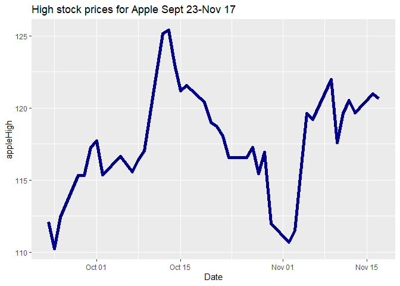
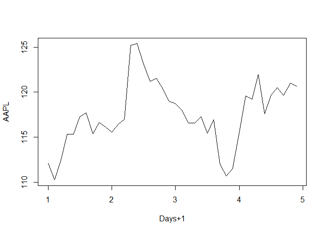
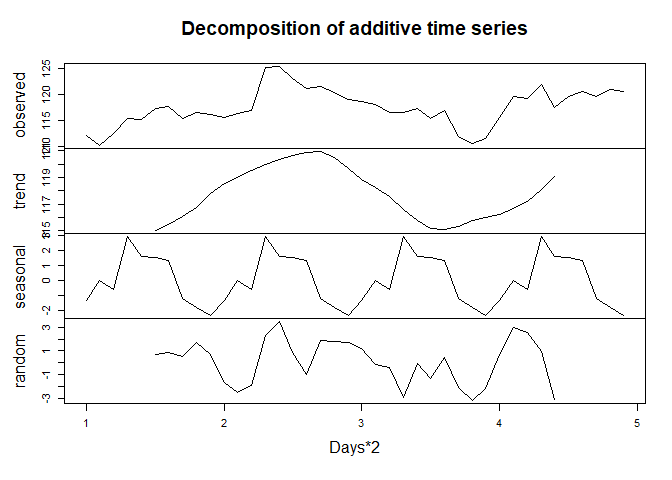
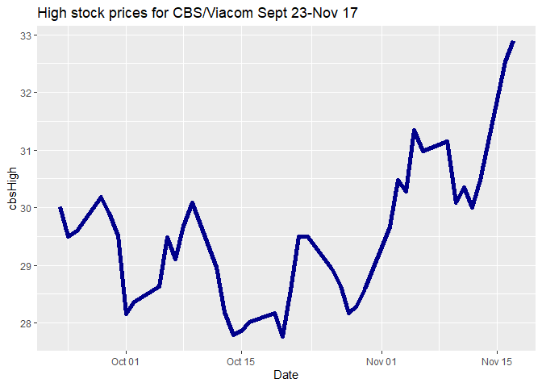
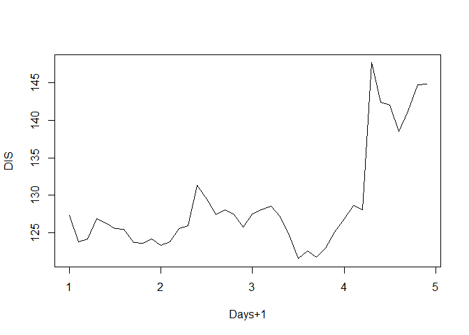

## Summary
### This project compares the high stock prices for 5 stocks: Apple, Netflix, CBS/Viacom, Amazon, and Disney. It took prices from the Yahoo Finance website <https://finance.yahoo.com/> for the dates from September 22, 2020 to December 22,2020.


```r
#attach libraries
library(ggplot2)
library(ggthemes)
library(tidyr)
library(quantmod)
```

```
## Loading required package: xts
```

```
## Loading required package: zoo
```

```
## 
## Attaching package: 'zoo'
```

```
## The following objects are masked from 'package:base':
## 
##     as.Date, as.Date.numeric
```

```
## Loading required package: TTR
```

```
## Registered S3 method overwritten by 'quantmod':
##   method            from
##   as.zoo.data.frame zoo
```

```r
library(dplyr)
```

```
## 
## Attaching package: 'dplyr'
```

```
## The following objects are masked from 'package:xts':
## 
##     first, last
```

```
## The following objects are masked from 'package:stats':
## 
##     filter, lag
```

```
## The following objects are masked from 'package:base':
## 
##     intersect, setdiff, setequal, union
```

```r
library(forecast)
```

## Loading Data
### Creating data folder, downloading datasets from Yahoo Finance and loading data into R Studio.

```r
if(!dir.exists("./data")) {dir.create("./data")}
download.file("https://query1.finance.yahoo.com/v7/finance/download/AMZN?period1=1600819200&period2=1608681600&interval=1d&events=history&includeAdjustedClose=true","./data/amazon.csv")

download.file("https://query1.finance.yahoo.com/v7/finance/download/AAPL?period1=1600819200&period2=1608681600&interval=1d&events=history&includeAdjustedClose=true","./data/apple.csv")

download.file("https://query1.finance.yahoo.com/v7/finance/download/VIAC?period1=1600819200&period2=1608681600&interval=1d&events=history&includeAdjustedClose=true","./data/cbs.csv")

download.file("https://query1.finance.yahoo.com/v7/finance/download/DIS?period1=1600819200&period2=1608681600&interval=1d&events=history&includeAdjustedClose=true","./data/disney.csv")

download.file("https://query1.finance.yahoo.com/v7/finance/download/NFLX?period1=1600819200&period2=1608681600&interval=1d&events=history&includeAdjustedClose=true", "./data/netflix.csv")
amazon<-read.csv("./data/amazon.csv")
apple<-read.csv("./data/apple.csv")
disney<-read.csv("./data/disney.csv")
cbs<-read.csv("./data/cbs.csv")
netflix<-read.csv("./data/netflix.csv")
```

## Data Wrangling
### Look at individual datasets, merge into a single dataset, and look at merged dataset.

```
##      Date                Open           High           Low           Close     
##  Length:64          Min.   :2978   Min.   :3069   Min.   :2950   Min.   :3000  
##  Class :character   1st Qu.:3135   1st Qu.:3161   1st Qu.:3088   1st Qu.:3118  
##  Mode  :character   Median :3179   Median :3201   Median :3137   Median :3175  
##                     Mean   :3184   Mean   :3219   Mean   :3138   Mean   :3177  
##                     3rd Qu.:3215   3rd Qu.:3251   3rd Qu.:3172   3rd Qu.:3208  
##                     Max.   :3468   Max.   :3496   Max.   :3424   Max.   :3444  
##    Adj.Close        Volume       
##  Min.   :3000   Min.   :2369400  
##  1st Qu.:3118   1st Qu.:3472400  
##  Median :3175   Median :4364450  
##  Mean   :3177   Mean   :4574408  
##  3rd Qu.:3208   3rd Qu.:5544125  
##  Max.   :3444   Max.   :8386400
```

```
## 'data.frame':	64 obs. of  7 variables:
##  $ Date     : chr  "2020-09-23" "2020-09-24" "2020-09-25" "2020-09-28" ...
##  $ Open     : num  3120 2978 3055 3149 3175 ...
##  $ High     : num  3127 3069 3102 3175 3188 ...
##  $ Low      : num  2992 2965 2999 3117 3133 ...
##  $ Close    : num  3000 3020 3095 3174 3145 ...
##  $ Adj.Close: num  3000 3020 3095 3174 3145 ...
##  $ Volume   : int  5652700 5529400 4615200 4224200 3495800 4896100 4971900 5613100 3775300 5086900 ...
```

```
##      Date                Open            High            Low       
##  Length:64          Min.   :105.2   Min.   :110.2   Min.   :105.0  
##  Class :character   1st Qu.:115.0   1st Qu.:116.5   1st Qu.:113.6  
##  Mode  :character   Median :117.6   Median :119.1   Median :116.3  
##                     Mean   :118.2   Mean   :119.8   Mean   :116.7  
##                     3rd Qu.:121.1   3rd Qu.:123.1   3rd Qu.:119.7  
##                     Max.   :131.6   Max.   :134.4   Max.   :129.6  
##      Close         Adj.Close         Volume         
##  Min.   :107.1   Min.   :106.9   Min.   : 46691300  
##  1st Qu.:115.1   1st Qu.:114.9   1st Qu.: 88488100  
##  Median :117.4   Median :117.3   Median :113216700  
##  Mean   :118.3   Mean   :118.2   Mean   :118827627  
##  3rd Qu.:121.8   3rd Qu.:121.8   3rd Qu.:142990850  
##  Max.   :131.9   Max.   :131.9   Max.   :262330500
```

```
## 'data.frame':	64 obs. of  7 variables:
##  $ Date     : chr  "2020-09-23" "2020-09-24" "2020-09-25" "2020-09-28" ...
##  $ Open     : num  112 105 108 115 115 ...
##  $ High     : num  112 110 112 115 115 ...
##  $ Low      : num  107 105 108 113 114 ...
##  $ Close    : num  107 108 112 115 114 ...
##  $ Adj.Close: num  107 108 112 115 114 ...
##  $ Volume   : int  150718700 167743300 149981400 137672400 99382200 142675200 116120400 144712000 106243800 161498200 ...
```

```
##      Date                Open            High            Low       
##  Length:64          Min.   :27.15   Min.   :27.77   Min.   :26.99  
##  Class :character   1st Qu.:28.68   1st Qu.:29.07   1st Qu.:28.23  
##  Mode  :character   Median :29.98   Median :30.32   Median :29.21  
##                     Mean   :31.28   Mean   :31.83   Mean   :30.79  
##                     3rd Qu.:34.80   3rd Qu.:35.31   3rd Qu.:34.24  
##                     Max.   :36.80   Max.   :37.32   Max.   :36.46  
##      Close         Adj.Close         Volume        
##  Min.   :27.13   Min.   :26.95   Min.   : 3903900  
##  1st Qu.:28.55   1st Qu.:28.35   1st Qu.: 8622475  
##  Median :29.80   Median :29.60   Median : 9489900  
##  Mean   :31.37   Mean   :31.19   Mean   :11025794  
##  3rd Qu.:34.86   3rd Qu.:34.84   3rd Qu.:12624750  
##  Max.   :36.95   Max.   :36.70   Max.   :26843600
```

```
## 'data.frame':	64 obs. of  7 variables:
##  $ Date     : chr  "2020-09-23" "2020-09-24" "2020-09-25" "2020-09-28" ...
##  $ Open     : num  29.7 28.6 28.9 30 29.6 ...
##  $ High     : num  30 29.5 29.6 30.2 29.9 ...
##  $ Low      : num  28.6 28.1 28.8 29.6 28.9 ...
##  $ Close    : num  28.8 29.1 29.5 29.8 29 ...
##  $ Adj.Close: num  28.6 29 29.3 29.6 28.8 ...
##  $ Volume   : int  9744900 13542900 9418000 9323400 11466500 9358800 13944100 9109000 5874900 8724400 ...
```

```
##      Date                Open            High            Low       
##  Length:64          Min.   :118.2   Min.   :121.5   Min.   :117.2  
##  Class :character   1st Qu.:124.3   1st Qu.:125.7   1st Qu.:123.2  
##  Mode  :character   Median :129.5   Median :130.4   Median :127.1  
##                     Mean   :138.4   Mean   :140.2   Mean   :136.7  
##                     3rd Qu.:149.5   3rd Qu.:151.5   3rd Qu.:148.0  
##                     Max.   :174.0   Max.   :179.4   Max.   :172.3  
##      Close         Adj.Close         Volume        
##  Min.   :118.5   Min.   :118.5   Min.   : 5177700  
##  1st Qu.:124.1   1st Qu.:124.1   1st Qu.: 7266400  
##  Median :128.7   Median :128.7   Median : 8998900  
##  Mean   :138.5   Mean   :138.5   Mean   :11765898  
##  3rd Qu.:150.0   3rd Qu.:150.0   3rd Qu.:11443700  
##  Max.   :175.7   Max.   :175.7   Max.   :87410700
```

```
## 'data.frame':	64 obs. of  7 variables:
##  $ Date     : chr  "2020-09-23" "2020-09-24" "2020-09-25" "2020-09-28" ...
##  $ Open     : num  127 122 121 126 126 ...
##  $ High     : num  127 124 124 127 126 ...
##  $ Low      : num  123 121 121 125 124 ...
##  $ Close    : num  123 122 124 126 125 ...
##  $ Adj.Close: num  123 122 124 126 125 ...
##  $ Volume   : int  8323600 8480000 6851800 6283700 7405800 13642500 8908300 6490200 5919200 9052000 ...
```

```
##      Date                Open            High            Low       
##  Length:64          Min.   :470.5   Min.   :477.0   Min.   :463.4  
##  Class :character   1st Qu.:486.7   1st Qu.:491.9   1st Qu.:478.9  
##  Mode  :character   Median :495.2   Median :506.3   Median :491.6  
##                     Mean   :503.3   Mean   :510.8   Mean   :495.6  
##                     3rd Qu.:518.1   3rd Qu.:526.6   3rd Qu.:507.6  
##                     Max.   :562.6   Max.   :572.5   Max.   :541.0  
##      Close         Adj.Close         Volume        
##  Min.   :470.5   Min.   :470.5   Min.   : 1906600  
##  1st Qu.:486.0   1st Qu.:486.0   1st Qu.: 3656950  
##  Median :497.9   Median :497.9   Median : 4348750  
##  Mean   :503.3   Mean   :503.3   Mean   : 5158317  
##  3rd Qu.:523.0   3rd Qu.:523.0   3rd Qu.: 5644475  
##  Max.   :554.1   Max.   :554.1   Max.   :17405700
```

```
## 'data.frame':	64 obs. of  7 variables:
##  $ Date     : chr  "2020-09-23" "2020-09-24" "2020-09-25" "2020-09-28" ...
##  $ Open     : num  491 471 474 489 490 ...
##  $ High     : num  491 477 485 492 496 ...
##  $ Low      : num  469 468 468 478 487 ...
##  $ Close    : num  471 473 483 491 493 ...
##  $ Adj.Close: num  471 473 483 491 493 ...
##  $ Volume   : int  3726400 3727200 3769400 4773500 3541500 4634100 8153700 6071200 4088100 4199000 ...
```

```
##       Date              amazonOpen     amazonHigh     amazonLow   
##  Min.   :2020-09-23   Min.   :2978   Min.   :3069   Min.   :2950  
##  1st Qu.:2020-10-14   1st Qu.:3135   1st Qu.:3161   1st Qu.:3088  
##  Median :2020-11-05   Median :3179   Median :3201   Median :3137  
##  Mean   :2020-11-06   Mean   :3184   Mean   :3219   Mean   :3138  
##  3rd Qu.:2020-11-30   3rd Qu.:3215   3rd Qu.:3251   3rd Qu.:3172  
##  Max.   :2020-12-22   Max.   :3468   Max.   :3496   Max.   :3424  
##   amazonClose   amazonAdj.Close  amazonVolume       appleOpen    
##  Min.   :3000   Min.   :3000    Min.   :2369400   Min.   :105.2  
##  1st Qu.:3118   1st Qu.:3118    1st Qu.:3472400   1st Qu.:115.0  
##  Median :3175   Median :3175    Median :4364450   Median :117.6  
##  Mean   :3177   Mean   :3177    Mean   :4574408   Mean   :118.2  
##  3rd Qu.:3208   3rd Qu.:3208    3rd Qu.:5544125   3rd Qu.:121.1  
##  Max.   :3444   Max.   :3444    Max.   :8386400   Max.   :131.6  
##    appleHigh        appleLow       appleClose    appleAdj.Close 
##  Min.   :110.2   Min.   :105.0   Min.   :107.1   Min.   :106.9  
##  1st Qu.:116.5   1st Qu.:113.6   1st Qu.:115.1   1st Qu.:114.9  
##  Median :119.1   Median :116.3   Median :117.4   Median :117.3  
##  Mean   :119.8   Mean   :116.7   Mean   :118.3   Mean   :118.2  
##  3rd Qu.:123.1   3rd Qu.:119.7   3rd Qu.:121.8   3rd Qu.:121.8  
##  Max.   :134.4   Max.   :129.7   Max.   :131.9   Max.   :131.9  
##   appleVolume           cbsOpen         cbsHigh          cbsLow     
##  Min.   : 46691300   Min.   :27.15   Min.   :27.77   Min.   :26.99  
##  1st Qu.: 88488100   1st Qu.:28.68   1st Qu.:29.07   1st Qu.:28.23  
##  Median :113216700   Median :29.98   Median :30.32   Median :29.21  
##  Mean   :118827627   Mean   :31.28   Mean   :31.83   Mean   :30.79  
##  3rd Qu.:142990850   3rd Qu.:34.80   3rd Qu.:35.31   3rd Qu.:34.24  
##  Max.   :262330500   Max.   :36.80   Max.   :37.32   Max.   :36.46  
##     cbsClose      cbsAdj.Close     cbsVolume          disneyOpen   
##  Min.   :27.13   Min.   :26.95   Min.   : 3903900   Min.   :118.2  
##  1st Qu.:28.55   1st Qu.:28.36   1st Qu.: 8622475   1st Qu.:124.3  
##  Median :29.80   Median :29.61   Median : 9489900   Median :129.5  
##  Mean   :31.37   Mean   :31.19   Mean   :11025794   Mean   :138.4  
##  3rd Qu.:34.86   3rd Qu.:34.84   3rd Qu.:12624750   3rd Qu.:149.5  
##  Max.   :36.95   Max.   :36.70   Max.   :26843600   Max.   :174.0  
##    disneyHigh      disneyLow      disneyClose    disneyAdj.Close
##  Min.   :121.5   Min.   :117.2   Min.   :118.5   Min.   :118.5  
##  1st Qu.:125.7   1st Qu.:123.2   1st Qu.:124.1   1st Qu.:124.1  
##  Median :130.4   Median :127.1   Median :128.7   Median :128.7  
##  Mean   :140.2   Mean   :136.7   Mean   :138.5   Mean   :138.5  
##  3rd Qu.:151.5   3rd Qu.:148.0   3rd Qu.:150.0   3rd Qu.:150.0  
##  Max.   :179.4   Max.   :172.3   Max.   :175.7   Max.   :175.7  
##   disneyVolume       netflixOpen     netflixHigh      netflixLow   
##  Min.   : 5177700   Min.   :470.5   Min.   :477.0   Min.   :463.4  
##  1st Qu.: 7266400   1st Qu.:486.7   1st Qu.:491.9   1st Qu.:478.9  
##  Median : 8998900   Median :495.2   Median :506.3   Median :491.6  
##  Mean   :11765898   Mean   :503.3   Mean   :510.8   Mean   :495.6  
##  3rd Qu.:11443700   3rd Qu.:518.1   3rd Qu.:526.6   3rd Qu.:507.6  
##  Max.   :87410700   Max.   :562.6   Max.   :572.5   Max.   :541.0  
##   netflixClose   netflixyAdj.Close netflixVolume     
##  Min.   :470.5   Min.   :470.5     Min.   : 1906600  
##  1st Qu.:486.0   1st Qu.:486.0     1st Qu.: 3656950  
##  Median :497.9   Median :497.9     Median : 4348750  
##  Mean   :503.3   Mean   :503.3     Mean   : 5158317  
##  3rd Qu.:523.0   3rd Qu.:523.0     3rd Qu.: 5644475  
##  Max.   :554.1   Max.   :554.1     Max.   :17405700
```

```
## 'data.frame':	64 obs. of  31 variables:
##  $ Date             : Date, format: "2020-09-23" "2020-09-24" ...
##  $ amazonOpen       : num  3120 2978 3055 3149 3175 ...
##  $ amazonHigh       : num  3127 3069 3102 3175 3188 ...
##  $ amazonLow        : num  2992 2965 2999 3117 3133 ...
##  $ amazonClose      : num  3000 3020 3095 3174 3145 ...
##  $ amazonAdj.Close  : num  3000 3020 3095 3174 3145 ...
##  $ amazonVolume     : num  5652700 5529400 4615200 4224200 3495800 ...
##  $ appleOpen        : num  112 105 108 115 115 ...
##  $ appleHigh        : num  112 110 112 115 115 ...
##  $ appleLow         : num  107 105 108 113 114 ...
##  $ appleClose       : num  107 108 112 115 114 ...
##  $ appleAdj.Close   : num  107 108 112 115 114 ...
##  $ appleVolume      : num  1.51e+08 1.68e+08 1.50e+08 1.38e+08 9.94e+07 ...
##  $ cbsOpen          : num  29.7 28.6 28.9 30 29.6 ...
##  $ cbsHigh          : num  30 29.5 29.6 30.2 29.9 ...
##  $ cbsLow           : num  28.6 28.1 28.8 29.6 28.9 ...
##  $ cbsClose         : num  28.8 29.1 29.5 29.8 29 ...
##  $ cbsAdj.Close     : num  28.6 28.9 29.3 29.6 28.8 ...
##  $ cbsVolume        : num  9744900 13542900 9418000 9323400 11466500 ...
##  $ disneyOpen       : num  127 122 121 126 126 ...
##  $ disneyHigh       : num  127 124 124 127 126 ...
##  $ disneyLow        : num  123 121 121 125 124 ...
##  $ disneyClose      : num  123 122 124 126 125 ...
##  $ disneyAdj.Close  : num  123 122 124 126 125 ...
##  $ disneyVolume     : num  8323600 8480000 6851800 6283700 7405800 ...
##  $ netflixOpen      : num  491 471 474 489 490 ...
##  $ netflixHigh      : num  491 477 485 492 496 ...
##  $ netflixLow       : num  469 468 468 478 487 ...
##  $ netflixClose     : num  471 473 483 491 493 ...
##  $ netflixyAdj.Close: num  471 473 483 491 493 ...
##  $ netflixVolume    : num  3726400 3727200 3769400 4773500 3541500 ...
```

## Amazon forecasting analysis
### The line chart of the Amazon data with the associated regression line shows a a slight decrease in the high price over time. When the time series was decomposed, the trend showed a clear decrease.  The seasonal trend showed 2 period where there was a clear decrease in the high price. tEh plot of the forecasted data along with the observed dsata showed that the forecasted results did fall withint the 95% confidence level of the observed data. In terms of accuracy, the root mean squared erro was 61% for the training data and 65% for the testing data, showing that the model did not do well in predicting future high procies of the Amazon stock.

```r
ggplot(data,aes(Date, amazonHigh, group=1))+
  geom_line(color="darkblue" ,size=2)+
  geom_smooth(method=lm,se=FALSE, colour="black")+
  ggtitle("High stock prices for Amazon Sept 22-Dec 22")
```

```
## `geom_smooth()` using formula 'y ~ x'
```

<!-- -->

```r
#ts function creates time series object
ts1 <- ts(data$amazonHigh,frequency=32)
#plot time series object(daily high prices for Amazon)
plot(ts1,xlab="Days+1", ylab="AMZN")
```

<!-- -->

```r
plot(decompose(ts1),xlab="Days+1")
```

<!-- -->

```r
#training & test sets-have to build sets with consecutive time points
ts1Train <- window(ts1,start=1,end=1.7)
#window function creates test set that starts at time point 1.8
ts1Test <- window(ts1,start=1.8,end=2.97)
```

```
## Warning in window.default(x, ...): 'end' value not changed
```

```r
#show test data
ts1Train
```

```
## Time Series:
## Start = c(1, 1) 
## End = c(1, 23) 
## Frequency = 32 
##  [1] 3127.00 3069.30 3101.54 3175.04 3188.26 3212.88 3224.00 3195.80 3202.53
## [10] 3182.00 3200.00 3233.29 3288.99 3496.24 3492.38 3464.88 3355.88 3399.66
## [19] 3329.00 3266.00 3233.88 3198.75 3205.33
```

```r
#simple moving average
#plot training data 
#moving average (ma function) to plot)
plot(ts1Train)
lines(ma(ts1Train,order=3),col="red")
```

<!-- -->

```r
#exponential smoothing
#fit model that had different types of trends you want to fit
ets1 <- ets(ts1Train)
#get predictions and prediction bounds with forecast function
fcast <- forecast(ets1)
plot(fcast); 
lines(ts1Test,col="red")
```

<!-- -->

```r
#get accuracy
#accuracy(forecast,test set)
accuracy(fcast,ts1Test)
```

```
##                      ME     RMSE      MAE        MPE     MAPE MASE      ACF1
## Training set   3.487367 60.88887 42.41716  0.0936610 1.285188  NaN 0.1943240
## Test set     -12.844079 64.49879 53.00355 -0.4413693 1.663304  NaN 0.5909089
##              Theil's U
## Training set        NA
## Test set      1.140216
```

## Apple forecasting analysis

```r
ggplot(data,aes(Date, appleHigh, group=1))+
  geom_line(color="darkblue" ,size=2)+
  geom_smooth(method=lm,se=FALSE, colour="black")+
  ggtitle("High stock prices for Apple Sept 22-Dec 22")
```

```
## `geom_smooth()` using formula 'y ~ x'
```

<!-- -->

```r
#ts function creates time series object
ts1 <- ts(data$appleHigh,frequency=32)
#plot time series object(daily high prices for Apple)
plot(ts1,xlab="Days+1", ylab="AAPL")
```

<!-- -->

```r
plot(decompose(ts1),xlab="Days+1")
```

<!-- -->

```r
#training & test sets-have to build sets with consecutive time points
ts1Train <- window(ts1,start=1,end=1.7)
#window function creates test set that starts at time point 1.8
ts1Test <- window(ts1,start=1.8,end=2.97)
```

```
## Warning in window.default(x, ...): 'end' value not changed
```

```r
#show test data
ts1Train
```

```
## Time Series:
## Start = c(1, 1) 
## End = c(1, 23) 
## Frequency = 32 
##  [1] 112.11 110.25 112.44 115.32 115.31 117.26 117.72 115.37 116.65 116.12
## [11] 115.55 116.40 117.00 125.18 125.39 123.03 121.20 121.55 120.42 118.98
## [21] 118.71 118.04 116.55
```

```r
#simple moving average
#plot training data 
#moving average (ma function) to plot)
plot(ts1Train)
lines(ma(ts1Train,order=3),col="red")
```

<!-- -->

```r
#exponential smoothing
#fit model that had different types of trends you want to fit
ets1 <- ets(ts1Train)
#get predictions and prediction bounds with forecast function
fcast <- forecast(ets1)
plot(fcast); 
lines(ts1Test,col="red")
```

<!-- -->

```r
#get accuracy
#accuracy(forecast,test set)
accuracy(fcast,ts1Test)
```

```
##                     ME     RMSE      MAE       MPE     MAPE MASE       ACF1
## Training set 0.1931471 2.201834 1.454897 0.1521136 1.224527  NaN 0.09104844
## Test set     4.7532719 6.970746 5.655943 3.7490213 4.556879  NaN 0.80636641
##              Theil's U
## Training set        NA
## Test set      2.985829
```

## CBS/Viacom forecasting analysis

```r
ggplot(data,aes(Date, cbsHigh, group=1))+
  geom_line(color="darkblue" ,size=2)+
  geom_smooth(method=lm,se=FALSE, colour="black")+
  ggtitle("High stock prices for CBS/Viacom Sept 22-Dec 22")
```

```
## `geom_smooth()` using formula 'y ~ x'
```

<!-- -->

```r
#ts function creates time series object
ts1 <- ts(data$cbsHigh,frequency=32)
#plot time series object(daily high prices for CBS/Viacom)
plot(ts1,xlab="Days+1", ylab="VIAC")
```

<!-- -->

```r
plot(decompose(ts1),xlab="Days+1")
```

<!-- -->

```r
#training & test sets-have to build sets with consecutive time points
ts1Train <- window(ts1,start=1,end=1.7)
#window function creates test set that starts at time point 1.8
ts1Test <- window(ts1,start=1.8,end=2.97)
```

```
## Warning in window.default(x, ...): 'end' value not changed
```

```r
#show test data
ts1Train
```

```
## Time Series:
## Start = c(1, 1) 
## End = c(1, 23) 
## Frequency = 32 
##  [1] 30.01 29.50 29.59 30.19 29.91 29.51 28.16 28.37 28.63 29.49 29.11 29.68
## [13] 30.08 28.97 28.18 27.79 27.87 28.02 28.17 27.77 28.57 29.50 29.50
```

```r
#simple moving average
#plot training data 
#moving average (ma function) to plot)
plot(ts1Train)
lines(ma(ts1Train,order=3),col="red")
```

<!-- -->

```r
#exponential smoothing
#fit model that had different types of trends you want to fit
ets1 <- ets(ts1Train)
#get predictions and prediction bounds with forecast function
fcast <- forecast(ets1)
plot(fcast); 
lines(ts1Test,col="red")
```

<!-- -->

```r
#get accuracy
#accuracy(forecast,test set)
accuracy(fcast,ts1Test)
```

```
##                       ME     RMSE       MAE         MPE     MAPE MASE      ACF1
## Training set -0.02163342 0.585874 0.4661975 -0.09318492  1.61106  NaN 0.1601363
## Test set      4.31289475 5.126751 4.4239474 12.13827228 12.52897  NaN 0.9116172
##              Theil's U
## Training set        NA
## Test set      6.508041
```

## Disney forecasting analysis

```r
ggplot(data,aes(Date, disneyHigh, group=1))+
  geom_line(color="darkblue" ,size=2)+
  geom_smooth(method=lm,se=FALSE, colour="black")+
  ggtitle("High stock prices for Disney Sept 22-Dec 22")
```

```
## `geom_smooth()` using formula 'y ~ x'
```

<!-- -->

```r
#ts function creates time series object
ts1 <- ts(data$disneyHigh,frequency=32)
#plot time series object(daily high prices for Disney)
plot(ts1,xlab="Days+1", ylab="DIS")
```

<!-- -->

```r
plot(decompose(ts1),xlab="Days+1")
```

```
## Warning in plot.window(...): relative range of values ( 40 * EPS) is small (axis
## 2)
```

<!-- -->

```r
#training & test sets-have to build sets with consecutive time points
ts1Train <- window(ts1,start=1,end=1.7)
#window function creates test set that starts at time point 1.8
ts1Test <- window(ts1,start=1.8,end=2.97)
```

```
## Warning in window.default(x, ...): 'end' value not changed
```

```r
#show test data
ts1Train
```

```
## Time Series:
## Start = c(1, 1) 
## End = c(1, 23) 
## Frequency = 32 
##  [1] 127.30 123.80 124.19 126.86 126.29 125.55 125.47 123.68 123.60 124.19
## [11] 123.31 123.75 125.55 125.94 131.36 129.50 127.40 128.12 127.40 125.73
## [21] 127.56 128.10 128.50
```

```r
#simple moving average
#plot training data 
#moving average (ma function) to plot)
plot(ts1Train)
lines(ma(ts1Train,order=3),col="red")
```

<!-- -->

```r
#exponential smoothing
#fit model that had different types of trends you want to fit
ets1 <- ets(ts1Train)
#get predictions and prediction bounds with forecast function
fcast <- forecast(ets1)
plot(fcast); 
lines(ts1Test,col="red")
```

<!-- -->

```r
#get accuracy
#accuracy(forecast,test set)
accuracy(fcast,ts1Test)
```

```
##                      ME      RMSE       MAE         MPE       MAPE MASE
## Training set  0.1035092  1.762049  1.242547  0.06941358  0.9794117  NaN
## Test set     21.4760402 26.980431 22.680005 13.30025392 14.2780438  NaN
##                    ACF1 Theil's U
## Training set 0.04350998        NA
## Test set     0.88362910  4.321543
```

## Netflix forecasting analysis

```r
ggplot(data,aes(Date, netflixHigh, group=1))+
  geom_line(color="darkblue" ,size=2)+
  geom_smooth(method=lm,se=FALSE, colour="black")+
  ggtitle("High stock prices for Netflix Sept 22-Dec 22")
```

```
## `geom_smooth()` using formula 'y ~ x'
```

<!-- -->

```r
#ts function creates time series object
ts1 <- ts(data$netflixHigh,frequency=32)
#plot time series object(daily high prices for Netflix)
plot(ts1,xlab="Days+1", ylab="NFLX")
```

<!-- -->

```r
plot(decompose(ts1),xlab="Days+1")
```

<!-- -->

```r
#training & test sets-have to build sets with consecutive time points
ts1Train <- window(ts1,start=1,end=1.7)
#window function creates test set that starts at time point 1.8
ts1Test <- window(ts1,start=1.8,end=2.97)
```

```
## Warning in window.default(x, ...): 'end' value not changed
```

```r
#show test data
ts1Train
```

```
## Time Series:
## Start = c(1, 1) 
## End = c(1, 23) 
## Frequency = 32 
##  [1] 491.04 477.00 484.87 492.00 496.29 504.63 529.55 526.37 520.99 521.82
## [11] 536.49 535.00 544.28 551.81 557.65 572.49 551.22 554.33 541.80 533.78
## [21] 506.85 495.14 490.06
```

```r
#simple moving average
#plot training data 
#moving average (ma function) to plot)
plot(ts1Train)
lines(ma(ts1Train,order=3),col="red")
```

<!-- -->

```r
#exponential smoothing
#fit model that had different types of trends you want to fit
ets1 <- ets(ts1Train)
#get predictions and prediction bounds with forecast function
fcast <- forecast(ets1)
plot(fcast); 
lines(ts1Test,col="red")
```

<!-- -->

```r
#get accuracy
#accuracy(forecast,test set)
accuracy(fcast,ts1Test)
```

```
##                       ME     RMSE      MAE         MPE     MAPE MASE      ACF1
## Training set -0.02938302 11.87793  9.50370 -0.03159219 1.816018  NaN 0.1839884
## Test set     15.05343921 21.87883 16.64579  2.88541712 3.213114  NaN 0.8152658
##              Theil's U
## Training set        NA
## Test set       2.41427
```

